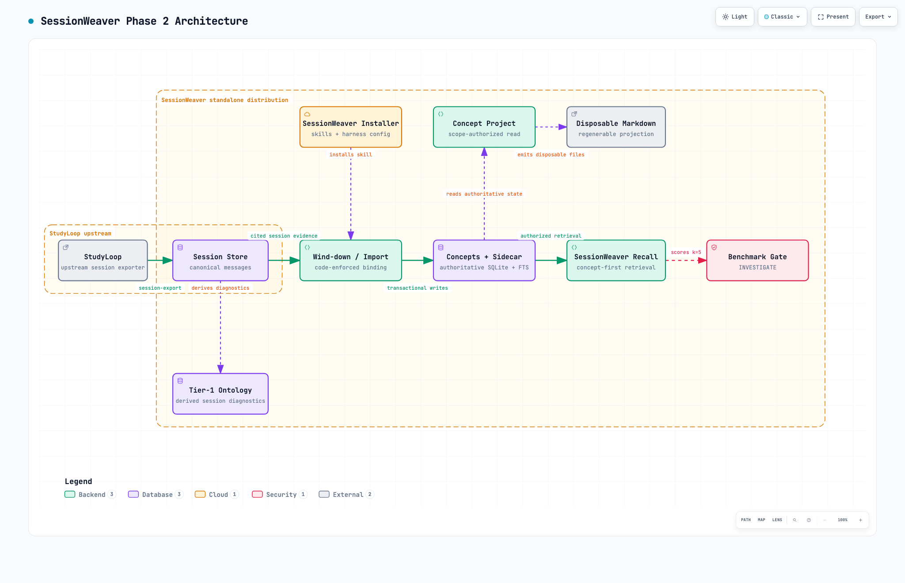
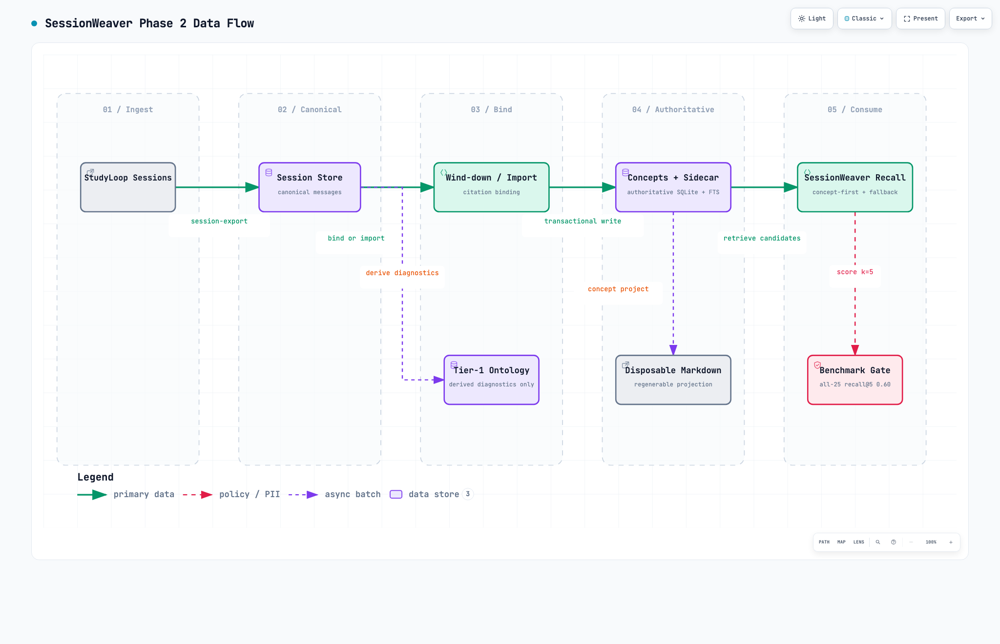
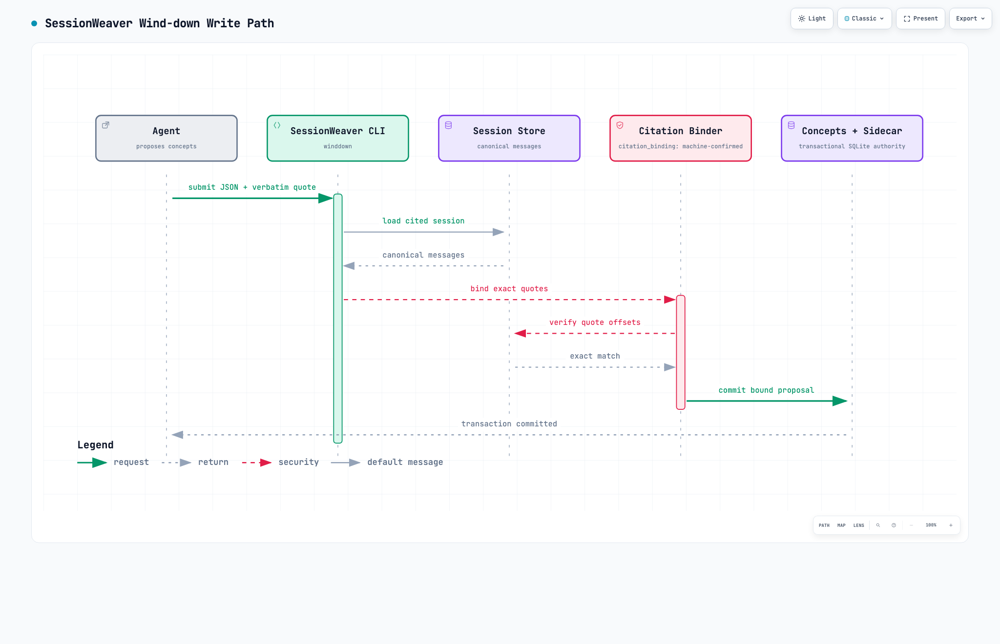

# SessionWeaver architecture

[Overview](../../README.md) · [OKF knowledge](../knowledge.md) · [Build the ontology](../ontology.md)

These are the retained Phase 2 Archify diagrams. The static PNG exports below render directly
in GitHub; the optional HTML viewers need to be downloaded and opened in a browser. The
diagrams describe component relationships, not proof of installation or an automatic scheduler.

## Components

The upstream session tools own capture and the base schema. SessionWeaver adds transactional
concept writing, authorized recall, disposable Markdown, ontology diagnostics and the skill
installer. The installer's “harness config” label means skill discovery paths; it does not
register MCP servers. The benchmark box represents a separate evaluation command, not a gate
on every user's recall request.

[Archify source](phase2-architecture.architecture.json) · [Optional viewer](phase2-architecture.html)
· [Delivery receipt](phase2-architecture.delivery.json)

## Data flow

The important direction is source evidence → authoritative SQLite concepts → authorized
recall or Markdown projection. Generated files do not write back into authoritative state.
“StudyLoop Sessions” names the upstream session-tool store; standalone capture supports all
six documented harnesses. The ontology's “read-only” flow label describes reading source
evidence; `ontology rebuild` itself writes derived tables.

[Archify source](phase2-dataflow.dataflow.json) · [Optional viewer](phase2-dataflow.html)
· [Delivery receipt](phase2-dataflow.delivery.json)

## Wind-down

The writer checks exact source text before persisting a proposed concept. Binding, authorship
and lifecycle acceptance are separate facts; see the [trust labels](../knowledge.md#read-the-trust-labels-separately).

[Archify source](phase2-winddown-sequence.sequence.json) · [Optional viewer](phase2-winddown-sequence.html)
· [Delivery receipt](phase2-winddown-sequence.delivery.json)

## Evidence and maintenance

The retained validation and visual-check receipts describe the exact delivered HTML.
These images reuse those exports; this documentation update does not claim a new Archify
delivery. The [claims audit](../claims-audit.md) records their validation and perceptual review.

The [older PoC diagrams](poc/README.md), `phase2-before.*`, storage experiment plans and
historical results remain provenance, not setup guides. Update a maintained specification and
its validated export together when behaviour changes; keep the GitHub image and prose aligned.
